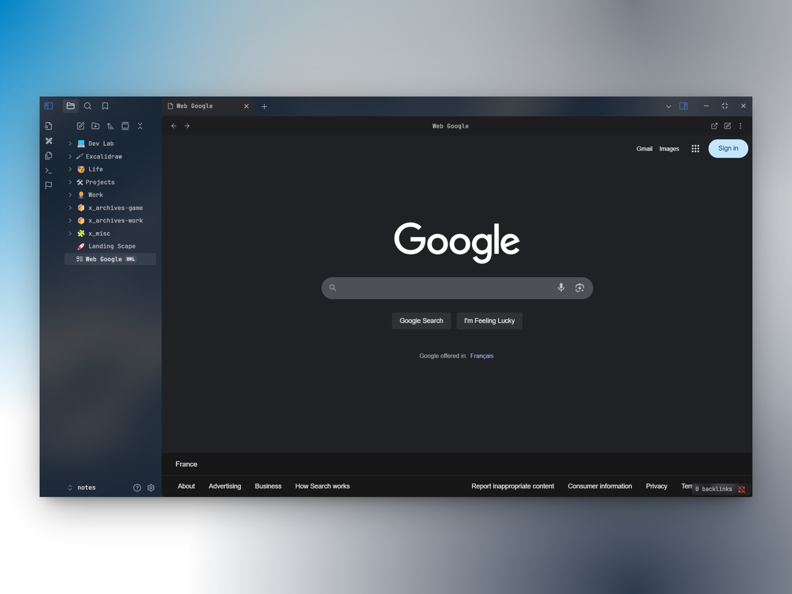

# .url WebView Opener

> A lightweight and minimalist Obsidian plugin to view, open, and edit `.url` files directly in Obsidian’s native webview.

---



## Installation

### From Obsidian (easiest)

Install the plugin from the [Community plugins](https://obsidian.md/plugins?search=.url%20webview%20opener) section in the app settings.

### From git

Clone the plugin in your `.obsidian/plugins` directory:

```shell
cd /path/to/your/vault/.obsidian/plugins
git clone git@github.com:kieirra/obsidian-url-extension.git
```

### From source

Download the [latest release](https://github.com/kieirra/obsidian-url-extension/releases) and unzip it in the `.obsidian/plugins/automatic-table-of-contents` directory.


## Usage

### Create URL file

Create a `.url` file with content:
```
https://example.com
```

Or Windows format:
```
[InternetShortcut]
URL=https://example.com
```

### View and Edit

- Click a `.url` file to open it in the Obsidian webview.
- Use the edit button (top right) to modify the URL.
- Use the open in browser button (top right) to launch the link in your default browser.

## Publish a new version

- Build the plugin with `npm run build` (`--watch` during dev)
- Push a commit with the new version number as message with:
  - The relevant changelog in `README.md`
  - The new version number in `manifest.json`
  - The updated `main.js` (with `npm run build`)
- Tag the commit with the version number
- Publish a [new GitHub release](https://github.com/kieirra/obsidian-url-extension/releases/new) with:
  - The version number as title
  - The changelog from `README.md` as description
  - `main.js` and `manifest.json` from as attachments
  - _Set as the latest release_ checked

## Changelog

| Version | Date | Notes |
| --- | --- | --- |
| `1.0.0` | 2023-08-27 | Initial version |

## License

This project is released under the [MIT License](LICENSE).

## Contributing

Bug reports and feature requests are welcome!